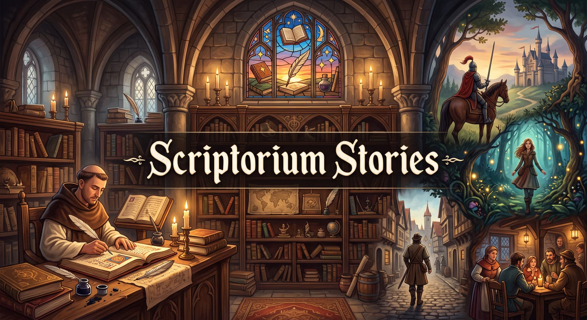

# scriptorium



A gated, multi-agent story engine that turns a premise into a narrated, illustrated video. Language-model roles plan, write, review and record each scene; nothing enters the story until a reviewer approves it. A finished run can then become a multi-voice audiobook, a set of consistent illustrations, and a YouTube-ready video with Ken Burns pans and subtitles.

```
worldbuilder → worldgate → creator/director → beatgate → writer → continuist ∥ critic
  → archivist → patchgate → commit → art director (references, shots, cover)
                                         ↓ after the run
                              artist (images) · audiobook (Kokoro) · video (ffmpeg)
```

All state lives in an append-only event log (`<run>/events.jsonl`). The story bible is always rebuilt by replaying it, so you can resume, rewind and fork a story at any scene.

## Quick start

```bash
npm install
npm run story:mock -- --scenes 3          # offline: mock models, placeholder art
```

For real runs, put your keys in `.env` (`cp .env.example .env`):

```
ANTHROPIC_API_KEY=...    # writing (anthropic providers)
GEMINI_API_KEY=...       # images and their checks, acted voices, music
OPENAI_API_KEY=...       # optional: responses providers
OPENCODE_API_KEY=...     # optional: opencode-go providers
```

Then check what your keys and tools can make (free; it only lists each service's models):

```bash
npm run doctor                          # ✓ / ✗ for writing, images, voices, music, video, review sheets
npm run doctor -- stories/keeper.json   # can this story run with these keys?
```

In Claude Code, the `setup` skill walks you through all of this: what each phase needs, where to get the keys, and a first mock run.

The easiest way to make a story is a **story file**: one JSON file holding everything about a story, which `make` turns into a finished video:

```jsonc
// stories/keeper.json — paths are relative to this file
{
  "config": "../story.opencode-go.config.json",  // or the config inline
  "out": "../runs/keeper",                        // a fixed run directory
  "premise": "a lighthouse keeper finds a letter addressed to her",
  "setting": "a remote northern coast, 1890s",
  "context": ["../contexts/keeper.md", "../contexts/coast.md"],
  "scenes": 3,
  "maxAttempts": "unlimited",
  "speakerTags": true,
  "audiobook": { "narratorVoice": "af_heart", "language": "en", "voiceGenders": {} }
}
```

```bash
npm run make -- stories/keeper.json                    # story → art → audiobook → video
npm run make -- stories/keeper.json --from audiobook   # just the later steps
npm run make -- stories/keeper.json --only art,video
```

Story files can also steer each creative layer directly. `artStyle` fixes the art style, overriding the Creator's choice. `direction` holds notes for individual layers, each added to that layer's prompts as instructions it must follow:

```jsonc
  "artStyle": "Cinematic, photorealistic, dramatic: like a frame from a fantasy action film",
  "direction": {
    "writer": "Keep fights fast and physical; short sentences in action.",
    "artdirector": "Favor low angles and dynamic action framing.",
    "artist": "Shallow depth of field, film grain, no painterly look."
  }
```

The layers are `contextgate`, `worldbuilder`, `worldgate`, `creator`, `director`, `beatgate`, `writer`, `continuist`, `critic`, `archivist`, `patchgate`, `artdirector` and `artist`. `artist` notes go with every image request and inspection. A misspelled layer is an error rather than silently ignored. Use context files for story facts, and `direction` for how each layer should work.

**The pitch.** `npm run pitch -- stories/keeper.json` shows what a story will need and cost **before anything is spent**:
- scenes still to write;
- images (references, shots, cover and retakes), and voice requests by Gemini mode, with the days of the 100-a-day voice cap they'll use;
- estimated cost and time for each, against the budget.

It's exact where the run already knows (written, tagged and directed scenes; images and audio already rendered are skipped, just as the steps skip them) and estimated where it doesn't. Costs come from the run's own ledger when it has history. `make` prints a one-line pitch when it starts, with warnings: more than a day of voice quota, or over budget.

**Image triage.** `"artist": { "retakes": 0.5 }` changes how images are retaken.
- Instead of retaking each rejected image on the spot, every shot is generated **once**. The inspector scores each from 0 (matches) to 10 (unusable), then the retakes go to the **worst-scored images first**: 0.5 means half a retake per shot on average.
- A retake is kept only if it scores better.
- Reference images keep their own full retake loop, since every shot depends on them.
- With a `budget`, the retakes are also capped at what the remaining money can buy.

**Batch Mode: half price, slower.** Gemini's Batch Mode runs many requests as one job at **50% of the price**, with its own rate limits. Results usually take a few minutes and at most 24 hours.
- `"artist": { "batch": true }` sends each stage's images as one job: the first reference, the other references, each scene's first shot, the other shots, then the cover. Retakes form the next job. Inspections stay live.
- `"audiobook": { "geminiBatch": true }` sends a scene's voice batches as one job in palette or speaker mode. Line mode stays live. **Not for Gemini 3.8 TTS (the default):** it reads its text verbatim and takes direction only as a live request's style, which Batch Mode can't carry, so it's voiced live at full price. The setting only applies to the older preview TTS models.
- A job is recorded as soon as it's submitted, so a stopped run **resumes polling the same job** rather than paying again.
- Batch calls are logged at half price, and the pitch shows the batch price.

**Order and parallelism.** After the story, `make` runs **audio before art** by default (`"stepOrder": "audio-first"`). Voicing is cheap, and listening is where you find a story that needs a rewrite, before any image is paid for. `"art-first"` reverses that, and `"parallel"` runs both at once, which is fastest. `--step-order` overrides it per run, and the video always waits for both.
- Within each step, `artist.concurrency` sets how many images render at once (default 4; 1 for one at a time).
- `audiobook.geminiConcurrency` sets how many Gemini voice batches run at once (default 2), always within the per-minute limit.
- Spending is tracked per run and per step even when steps overlap, so a budget covers everything running together.

Re-running `make` finishes whatever's missing: the story resumes from its event log, and art, audio and video skip finished work. That covers a crash, running out of credits, or a deleted image you want regenerated. The run records its premise, setting, context and speaker tags, and `make` refuses to change them for a story already in progress unless you pass `--force`. Use a new `out` for a new story. `stories/mock.json` runs the whole pipeline offline; `stories/example.json` is a real one.

The individual commands below still work for one-off steps.

## Run with Docker

The image has Node, ffmpeg, ImageMagick, fontconfig and the npm dependencies installed (about 1 GB). Your checkout is mounted at `/app`, so stories, contexts, runs and `.env` stay on your machine. Rebuild only when `package-lock.json` changes.

```bash
docker compose build
docker compose run --rm scriptorium doctor                              # what your keys and tools can make
docker compose run --rm scriptorium make stories/mock.json              # a free mock run
docker compose run --rm scriptorium make stories/foo.json --only story  # any CLI command
docker compose run --rm --entrypoint npm scriptorium test
```

- Files written to `runs/` belong to UID/GID 1000. If yours differ, `export SCRIPTORIUM_UID=$(id -u) SCRIPTORIUM_GID=$(id -g)` first (bash won't let you set `UID`).
- **Rootless Podman:** add the override so files stay yours: `podman-compose -f docker-compose.yml -f compose.podman.yml run --rm scriptorium doctor`.
- Kokoro's voice model and the Gemini voice list are cached in the `cache` volume, so they download once.
- To run Claude Code's `produce` and `setup` skills, run Claude Code on your machine as usual. Its commands work the same through `docker compose run --rm scriptorium …`.

## Commands

| Command | What it does |
|---|---|
| `make <story.json> [--only <steps>] [--from <step>] [--force]` | Run a story file's pipeline (`story`, `art`, `audiobook`, `video`), finishing whatever's missing. `--force` allows changed story settings for a story in progress. |
| `run --config <file> [--out <prefix>] [--scenes N] [--premise ".."] [--setting ".."] [--context <file.md> …] [--max-attempts N\|unlimited] [--speaker-tags]` | Generate a story, then render its art. `--out` is a prefix (`runs/keeper` → `runs/keeper-<timestamp>`); pointing it at an existing run directory resumes that run. |
| `fork --from <dir> --at <sceneCount> --out <dir>` | Branch a run after a given scene. |
| `show --out <dir>` / `bible --out <dir>` | Print the story as markdown / the current bible as JSON. |
| `audiobook --out <dir> [--narrator-voice <id>] [--language <prefix>] [--voice-gender id=male,…] [--exclude-voices id,…] [--force]` | Narrate each scene to `audiobook/scene-NN.wav` with local Kokoro TTS. Scenes whose text and voice settings are unchanged are skipped. |
| `art --out <dir> [--config <file>] [--force]` | Render (or resume/retry) a run's images. Unchanged images are skipped. |
| `artdirect --out <dir> [--config <file>] [--redo kind:id,…] [--note ".."]` | Redo the art direction for an existing run (references, shots, cover), then render. |
| `video --out <dir> [--force]` | Assemble art + audiobook into `video/story.mp4`. |
| `cast <story.json> [--as "..."]` | Preview a story's cast: describe each member from their photos and render one portrait each into `<run>/cast/preview/`. |
| `review <story.json> refs\|shots\|voices\|music` | Rebuild the run's current review files in `<run>/review/`: contact sheets, the voice reel and its legends. |
| `approve <story.json> <key>… [--revoke]` | Lock approved images (`scene-03-07`, `character-nell`) and voices (`voice:nell`) so nothing redoes them. |
| `audition <story.json> <speaker> [--direction ".."] [--voices a,b] [--count N]` | Their reel line in their current voice and a few others (the voice director's picks, or yours), as a review round. `--pick N` pins candidate N in the story file, makes the new direction their vocal line, and remakes their sample and the reel. |
| `cost --out <dir>` | What a run has spent, by step, role and model. |
| `models --config <file> --provider <name>` | List the model ids a provider serves. |

npm shortcuts: `make`, `story` (real config), `story:mock`, `art`, `artdirect`, `video`, `test`, `typecheck`. Run `node src/cli.ts` with no command for the full usage text.

## What's in a run folder

A story file's `"out"` folder holds everything the pipeline made for that story. Some of it is **canon**: the story itself and your decisions, which can't be remade. Some is **paid for**: it can be remade, but that costs money and won't come out the same. The rest can be **rebuilt for free**.

| Path | What it is | Delete it? |
|---|---|---|
| `events.jsonl` | **Canon.** The story's event log: every committed scene, the bible, art direction, speaker tags, voice palettes and audition lines. Everything else is built from it. | Never. |
| `characters.json` | **Canon.** Your character sheet. Filled fields override the generated bible. | Never. |
| `references/` | **Canon.** Your own drawings of characters (copied from the sheet's `reference`). | Never. |
| `approvals.json` | **Canon.** What you've signed off on. Approved work is never redone. | Never. |
| `story-settings.json` | The settings the story was written under, so `make` can warn when the story file changes them. | No. |
| `usage.jsonl` | The spend ledger. The budget cap is checked against it. | No: deleting it resets the budget. |
| `art/` | **Paid for.** One folder per kind: `character/`, `location/`, `prop/`, `scene/01/…` (one per scene, a file per shot), `cover/` and `extra/`, plus `art.json`, which records which prompt made each image and where it is. `batch-jobs.json` tracks batch jobs still in flight. Runs made before the folders are moved into them the next time art runs. | Only to redo all the art, at full cost. Approved images can't be reproduced. |
| `audiobook/casting.json` | The cast: who has which voice. Voices pinned in the story file (`audiobook.geminiVoices`) win over it. | No: deleting it recasts every voice that isn't pinned. |
| `audiobook/` (the rest) | **Paid for.** Scene audio, timings, `samples/` (the casting reel's samples) and the batch cache. | Remade on the next run, at cost. |
| `music/` | **Paid for.** The score's cues. | Remade on the next run, at cost. |
| `video/` | The finished video, its parts and titles. Made locally. | Yes: free to rebuild (`--only video`). |
| `review/` | The current review files: contact sheets, the voice reel and its legends. | Yes: `npm run review` rebuilds it. |
| `review/rounds/` | Every audition, redo and retake, numbered in order (`07-auditions-hellga/`). Each holds one file to look at (`changed.jpg` or `all.mp3`), a `legend.txt` and a `round.json`. | Yes, once you've decided. An audition's `--pick` needs its round. |
| `story.md` | The story as markdown, rewritten from `events.jsonl`. | Yes: `show --out <run>` prints it again. |
| `threads/` | Every model call's prompt and reply, numbered, for debugging. | Yes. |
| `logs/`, `notes/`, `backups/` | Yours or your assistant's: run logs, working notes, event-log backups. | Yours to decide. |

Outside the run folder, the story file in `stories/`, your `contexts/` and any `castingFile` shared across chapters are canon too.

## The roles

| Role | Job | Required |
|---|---|---|
| **contextgate** | Before anything is generated, checks the author's context files for contradictions between them or with the premise. | optional (falls back to the continuist) |
| **worldbuilder** | Names characters and places that belong in the setting. | optional |
| **creator** | Builds the foundation: premise, tone, **art style**, cast (with gender), locations, **key objects**, threads, the story's **tension arc**, and scene 1's beat. Runs on the `director`'s provider. | — |
| **director** | Plans each later scene as a JSON beat spec, including the scene's **turn**. Never writes prose. | yes |
| **writer** | Writes the scene in the POV character's voice, inside a word band. | yes |
| **editor** | Line-edits each draft before review: hunts machine-prose tics, trims about 10%, and keeps every event, name and speaker tag. An edit that guts or pads the scene is discarded. | optional |
| **continuist** | Blocks continuity and canon errors: POV, timeline, constraints, setups, key-object contradictions. | yes |
| **critic** | Blocks craft problems: pacing, telling-not-showing, sensory detail, voice drift, recurring style tics. | optional |
| **archivist** | The only role that changes the bible, via JSON patches. | yes |
| **worldgate / beatgate / patchgate** | Review the worldbuilder's output, each beat spec, and each bible patch before they're used. | optional (fall back to the continuist / critic) |
| **voicedirector** | Before the audiobook: labels who speaks each paragraph and how (a delivery note per line), designs each character's and the narrator's tone palette from the whole script, and picks each line's tone from it. Never changes the text; quote-mark checks catch its mistakes. Defaults to the continuist's model. | optional |
| **artdirector** | After each scene: a sequence of shots, plus canonical visual references for what they show; at the end, the cover. | optional |

Every role is mapped to a provider in the config, so each can run on a different model.

### The bible

The bible holds the premise, tone, **art style**, characters (traits, goal, voice sheet, gender), locations, **key objects**, threads, the Chekhov ledger of open setups, resolved decisions, and rolling scene summaries. Some of it is canon that can't be rewritten later: a character's recorded gender, and a key object's physical description. A key object is a signature item such as an instrument, a relic or a letter. Its spec gives size and width, shape, materials and how it's held. The writer must depict it as specced, and the continuist flags any contradiction.

### The review loop

The continuist and the critic review every draft in parallel, and both must approve. A rejected draft climbs a ladder:

1. Three surgical revisions.
2. A fresh draft from scratch.
3. A regenerated beat spec, on the theory that the spec is the problem.

A reviewer that only repeats complaints it already made counts as approving. Repeats are matched by meaning, not wording. A passage flagged in three drafts, by either reviewer, skips straight to a new beat: that's reviewers disagreeing, or a demand that can't be met. The continuist stays in its lane, and craft complaints from it are dropped. `--max-attempts` caps the drafts per scene (default 3). `unlimited` keeps going until both reviewers approve.

`"critic"` in the config or story file sets how much say the critic has:

- `"blocking"` (the default): both reviewers must approve, as above.
- `"advisory"`: the critic never holds a scene back. Only the continuist can reject a draft. When it does, the writer gets the critic's notes as optional suggestions alongside the continuity fixes. A draft with clean continuity commits, and any critic notes are dropped.
- `"off"`: the critic isn't called at all. This saves its calls.

### Context files

`--context <file.md>` hands your own notes to every role that plans or reviews the story: characters, places, history, and how things really work. Use it for facts the models get wrong, such as how an unusual object is held or played. See `contexts/` for examples.

`--context` can be repeated to mix and match, for example `--context world.md --context hero.md --context rival.md`. Each file goes in under a `### from <file>` header, so every role can tell where a detail came from. The run remembers its context, so resuming without `--context` uses the same files.

Before anything is generated, the **context gate** checks the combined files. It looks for hard contradictions: two files disagreeing about a fact, a file conflicting with the premise or setting, or a file contradicting itself. If it finds one, the run stops before spending anything and lists each conflict with both sides quoted. Mixing that's merely unusual, such as a character from one file dropped into another file's world, is the point and passes.

### Starring you: a cast from photos

A story file can list a **cast**: real people and animals who star in the story, each with one or more photos. Photo paths are relative to the story file.

```jsonc
  "cast": [
    { "name": "Don", "photos": ["../cast/don-1.jpg", "../cast/don-2.jpg"], "notes": "he/him; the reluctant hero" },
    { "name": "Biscuit", "photos": "../cast/biscuit.jpg", "notes": "Don's corgi, braver than he is" }
  ]
```

- **Casting.** Before the story starts, Gemini looks at each member's photos and writes a lasting description: build, age range, hair and face, or breed and markings. A member is described again only when their name, notes or photos change.
- **The story.** The cast joins the author context, so the story writes everyone in under their own names. A title or surname is fine, as in "Sir Don of the Hills".
- **The art.** Each cast member's reference portrait is drawn **from their photos**, in the story's art style and in the costume the story gives them. Every shot is built from those portraits.
- **Likeness checks.** The usual rule that characters must not look like real people doesn't apply to the cast. The inspector checks the reverse instead: that each cast member is recognizably the person or animal in the photos.

Keep photos in a top-level `cast/` folder, which git ignores so they are never committed. They are copied into the run's `cast/` folder, and are sent to Gemini to describe and draw the cast, but go nowhere else. Two or three clear, well-lit photos, with at least one showing the face, work best. Use `.jpg`, `.png` or `.webp` files.

To check the likeness before running a whole story, preview the cast:

```bash
npm run cast -- stories/us.json                                  # one portrait each, in the story's art style
npm run cast -- stories/us.json --as "adventurers in leather armor"
```

This describes everyone, recording the descriptions in the run so the story reuses them. It then renders one portrait each from the photos into `<run>/cast/preview/`. That costs a few cents per member. If a portrait isn't right, swap or add photos, or adjust `notes`, and preview again.

## Audiobook

`audiobook` narrates each scene with [Kokoro](https://github.com/hexgrad/kokoro), running locally, so it needs no API key and can run offline. The first run downloads the model.

- **Multiple voices, automatically.** The writer writes plain prose. Before the audiobook, the **voice director** (the config's `voicedirector` role, else the continuist's model) labels who speaks each paragraph. Each character then gets their own voice, quoted dialogue is voiced by its speaker, and narration is read by the narrator.
  - The labels are stored beside the story; the text itself is never changed, and the voice director never even sends it back.
  - Speakers the bible doesn't have, such as a dragon or a guard, get voices too.
  - The voice director also writes a short **delivery note** per line ("low and furious, trying not to be overheard"), which directs Gemini's performance. Kokoro can't act, so it ignores them.
  - From the command line, pass `--config` to `audiobook` so untagged scenes can be tagged. Older runs written with `--speaker-tags` are used as they are.
- **Every Gemini take is checked.** The speech model sometimes says a different word than it was given, usually a rare name swapped for a common one ("Liam McPoyle" came out as "McCord", "McCoy", "McCorkle"). So Gemini listens to each take against its script, and a take with a wrong, added or missing word is redone, up to 3 tries. A line still wrong after that is kept (the closest take) and listed in a review round, `review/rounds/NN-speech-check-…/legend.txt`, for you to hear. It costs one short listening call per take.
- **Pronunciations.** `"audiobook": { "pronunciations": { "McPoyle": "mick-POYL (rhymes with boil)" } }` adds "Pronounce McPoyle as …" to the direction of every line that says it (plurals and possessives too). The words themselves stay as written. Add a name when the speech check keeps catching it: for McPoyle, a hint took a voice from about 1 right take in 3 to 4 in 4. When the model still reads the spelling (it said "Ree-ANN" for Riann whatever the hint), give the words to say instead: `"Riann": { "say": "Ryan" }` changes only what's spoken; the story and subtitles keep "Riann".
- **Voice casting.** When Gemini speaks, every speaking character is cast a voice from **Gemini's voice library**: about 760 English voices across 8 regions, each with Google's notes on gender, pitch, accent, persona and an age-and-manner description. Searching the library is free and cached for a week.
  - The voice director matches each character's `vocal` line (how they sound: age, pitch, texture, accent, written by the creator or archivist) against the library. It keeps family members on a shared accent, keeps the main characters distinct, and picks a narrator from the storyteller voices. Code checks every pick: it must exist in the library, match the character's gender and not repeat another voice.
  - Characters who never speak, like a remembered grandmother, aren't cast.
  - The cast list is kept in `audiobook/casting.json`. `"castingFile": "../casts/series.json"` shares one cast list across every chapter of a series, so existing picks stay and only new speakers get cast.
  - `"designVoices": ["osmagus"]` gives a lead a **designed voice**, made once from their `vocal` description. It's a permanent `voice_…` id, kept for a year after last use, and its preview is saved to `audiobook/voices/`.
  - `"geminiVoices"` pins any voice, whether one of the 30 built-in voices, a library voice (`en-gb-advisor-9`) or a designed one, and always wins. `"casting": false` turns casting off.
- **Gemini modes.** Gemini TTS allows few requests (Tier 1: 10 a minute, 100 a day), so `"geminiMode"` in the `audiobook` block (or `--gemini-mode`) trades direction for requests. The dollar cost is about the same in every mode: you pay for the audio.
  - `"line"` (the default): one request per line, each with its own delivery note. The best, and the most requests (a few hundred for a 4,000-word story).
  - `"palette"`: the voice director gives each character a palette of `paletteSize` tones (default 4) designed from the whole script. The narrator gets one too, in this story's own registers; its first tone is its home register, used for plain narration. Lines are batched by speaker and tone, a few dozen requests in total.
  - `"speaker"`: lines are batched by speaker with no direction. The fewest requests.
  - In the batched modes, Gemini is asked for a long pause between lines. The audio is cut where the pieces best match each line's expected length, worked out from its letters and that take's pace, so a two-word line can't swallow its neighbour. Each piece is then checked against its words.
  - A batch that won't cut cleanly is retaken, then split in half and tried again. Narrator batches stay small (8 lines), because narration has the most pauses inside lines.
  - Requests are paced to `geminiRpm` (default 9) per minute, and a rate limit waits rather than falling back.
  - **Every take is paid for once.** Each batch that cuts cleanly is saved in `audiobook/batches/` as a playable WAV, keyed by its exact prompt, voice and model. A re-run, after a quota stop or a crash, re-cuts the saved takes and asks Gemini only for what's missing. Running out of quota stops the run with a "re-run later" message, and never falls back to Kokoro.
  - **`geminiFallback`** decides what happens to a Gemini line that keeps failing. With `"gemini"`, the default for an all-Gemini story, it gets retried with just the bare line, then the shortest take is kept and flagged in the log. With `"kokoro"`, the default when the story uses Kokoro anyway, Kokoro reads it.
- **Gender-matched voices:** a character whose gender is known gets a voice of that gender. Use `--voice-gender` to set genders for older runs.
- **Voice curation:** `"kokoroVoices": { "exclude": ["am_adam"] }` in a story file's `audiobook` block (or `--exclude-voices`) keeps weak or overused voices out. An `include` list instead limits the cast to exactly those voices.
- **Chosen voices:** `"characterVoices": { "osmagus": "bm_george" }` in the `audiobook` block (or `--character-voice osmagus=bm_george`) gives a character the voice you pick, by bible id. Nobody else is assigned that voice.
- **Timings:** `audiobook/timings.json` records each scene's duration and the start time of every paragraph. Video assembly uses it.
- **Acted dialogue (optional):** `--dialogue gemini`, or `"dialogue": "gemini"` in a story file's `audiobook` block, has Gemini TTS perform each character's lines while Kokoro keeps the narration. Each line gets the character's traits and voice sheet from the bible plus the narration just before it, in Gemini's structured prompt format, so only the line is spoken. Characters get distinct, gender-matched Gemini voices (override with `geminiVoices`). A failed or implausibly long reply is retried once, then falls back to that character's Kokoro voice. It costs cents per chapter (Gemini Flash TTS is about $0.81 per hour of generated audio at 2026 rates). `"narration": "gemini"` moves the narration over too.
- **Curating Kokoro voices:** `--exclude-voices af_bella,am_michael`, or `"kokoroVoices": { "exclude": […] }` / `{ "include": […] }` in a story file, drops weak or overused voices from character assignment.

## Art

The **art director** works in three layers:

1. **Art style.** The creator decides how the world is portrayed (medium, palette, light, line, detail, mood) along with the tone. Every image in the story uses it, and each story gets its own.
2. **Visual references.** One canonical image per **character** (full-body portrait), **location** (an establishing view with no people) and **key prop** (the object alone, at true proportions). Each is made once. Characters and locations get theirs the first time a shot shows them, so someone the story only mentions, such as a remembered grandmother or a figure in a mural, never costs a portrait. When a scene's shots introduce someone new, the shots are directed again once that person's reference exists, so the prompts use their canonical look. Characters' looks follow the bible and how the prose describes them. Props come from the bible's key objects, plus any others the art director finds in the prose.
3. **Shots.** About one per 110 words of narration (roughly 45 seconds read aloud; `artWordsPerShot`), 4–20 per scene. Each shot is anchored to the paragraph where it comes on screen and lists the characters, location and props it shows.

The **artist** renders them with Gemini (`GEMINI_API_KEY`). References render first. Each shot then gets the references for what it shows as labelled reference images: up to 3 characters, its location and 2 props, plus a recent image for style. An **inspector** checks each image against its prompt, its references and the art style, and flags anything that resembles a real person. It requests a revised regeneration up to `maxAttempts` times.

- **Request size:** reference images are sent downscaled (768 px), which keeps requests small.
- **Resuming:** everything is recorded in `art/art.json`, so a re-run skips finished images. Use `art` to resume after an interruption.

Output goes to `<run>/art/`: `character-<id>`, `location-<id>`, `prop-<id>`, `scene-NN-SS` (scene NN, shot SS) and `cover`.

**Fixing a bad reference:** run `artdirect --redo prop:<id> --note "what's wrong and what it should be"`. The note is passed to the art director as a correction from you.

**Reshoots:** each shot records which reference images it was drawn from, with a fingerprint of each.
- **When a reference changes** (a remade portrait, a new prop design, your own drawing), every shot drawn from the old version is out of date. The next `make --only art` reshoots just those, and approved shots stay with a warning. `npm run reshoot -- <story>` lists them by scene with the cost first. On the shots contact sheets they're marked ⟳.
- **One shot:** `make --only art --redo scene-04-07 --note "lying flat, seen from above"` redoes that shot. The note stays with its prompt. `--redo scene:4` re-plans scene 4's shots.
- **The video follows:** a reshot scene re-renders only its own video section and the final join.

**Your own drawing of a character:** give their entry on the character sheet (`<run>/characters.json`) a `"reference"`: a `.png`, `.jpg` or `.webp` path, relative to `characters.json`. For example, `"reference": "../../contexts/rantouls-mushrooms/Lemuel-drawing.png"`.
- **Portrait:** their portrait is drawn with the image as your design. It keeps the face, hair, colouring, clothing and gear, but redraws them in the story's art style.
- **Checking:** the inspector checks the portrait follows the drawing, and never mistakes the drawing for a real person.
- **Copy:** the image is copied into the run (`references/<id>.<ext>`), so the run stands on its own.
- **Changes:** a new image, even at the same path, remakes that portrait on the next `--only refs`, unless you've approved the portrait.
- **Description:** keep a written `appearance` too. The art director writes every shot from text, so the words carry the look into scenes.

### Extras

`npm run make -- <story.json> --only extras` makes the bonus artwork, at 2K, without text (titles are set separately):

- **Key art**, the story's streaming tile, at 2:3, 16:9 and 1:1. It's the story's cover, reframed to each shape, so it always matches the cover. It's re-made whenever the cover changes.
- **A cast photo**: the principal characters posing out of character on set.

`npm run review -- <story.json> extras` makes their contact sheet. `--redo extra-cast` retakes one, and `--redo extras` directs both again. By default they use the story's art style and direction. To set them explicitly:

```jsonc
"extras": {
  "style": "…",                     // replaces the story's art style, for every extra
  "direction": "…",                 // replaces the author's art direction for the image model
  "keyArt":    { "style": "…" },    // just the key art
  "castPhoto": { "direction": "…" } // just the cast photo
}
```

The most specific setting wins. Changing one re-makes only the extras it applies to.

With a `title` in the story file, the extras phase also builds, in code and for free:

- **A title logo:** the art director briefs it and the image model letters it, as one line (`logo.png`) and stacked (`logo-stacked.png`).
  - The image model draws it on flat green, which is keyed out to a transparent PNG.
  - A reader checks every letter of the title. A take with a wrong letter, or a background that didn't key out cleanly (edges not clear, green left behind), is redrawn.
  - After three failed tries it falls back to a typeset logo, for which the art director picks one of the bundled fantasy display fonts and a finish (gilded, bronze, silver, iron, parchment, plain), with an optional arch.
  - `logo-mono.png` is a white version for spines and small sizes.
  - `--redo extra-logo` draws it again.
- **Shelf covers:** the key art with the logo over it, at the sizes streaming apps use: `cover-2x3.jpg` (2000×3000), `cover-16x9.jpg` (3840×2160) and `cover-1x1.jpg` (2000×2000).
- **Box art:** a VHS/DVD case laid out flat, back, spine and front, in `box/box.jpg`. The back has a tagline, four approved stills, a synopsis, a billing block and a rating box. The art director writes the copy once (it's rewritten only when the title or story changes).

All of these go in `art/extra/`, and `npm run review -- <story.json> extras` adds `review/extras-covers.jpg`. To set the logo yourself, use `"extras": { "logo": { "mode": "typeset", "font": "Uncial Antiqua", "treatment": "bronze", "arc": 18 } }`. The bundled fonts are Cinzel, Cinzel Decorative, EB Garamond, IM Fell English SC, MedievalSharp, Metamorphous, New Rocker, Pirata One and Uncial Antiqua (all OFL, in `assets/fonts/`); a system font name also works. `"box": false` skips the box.

## Video

`video` turns a run's art and audiobook into:

- `video/story.mp4`: 1080p30 H.264 + AAC, ready for YouTube
- `video/thumbnail.jpg`: 1280×720, from the cover
- `video/story.srt`: subtitles, one cue per sentence

It needs `ffmpeg` on the `PATH`.

**Timing:** each shot comes on screen when the narration reaches its paragraph, and holds until the next one. A shot held longer than 25 seconds gets several moves on its image. Shots that would show for under 6 seconds are dropped.

**Movement:** each shot gets an eased Ken Burns move: a zoom in or out, a pan, or a push toward one side. Consecutive shots never repeat a move, and shots crossfade over 1.5 seconds.

**Titles and cards:** the video opens on the cover, slowly pushing in, with the story's title fading up over it (8 seconds). Each scene fades to black, then gets a card ("II" over "The Howling Hen"), then fades up. The last shot holds after the narration ends. The video closes on "The End" (or "To be continued" for a series chapter), credit cards naming each speaking character and their voice, and a "Next:" card for a series. Text is drawn in EB Garamond, with Cinzel for the title and the ending; both are bundled in `assets/fonts/` under the SIL Open Font License.

**Scene titles:** the first source with a title wins:

1. `video.titles.sceneTitles` in the story file.
2. The author's plan: lines like `Scene 2 — The pardon (the cell, dawn)` in the context files.
3. The title the director gave the scene's beat.

A scene with no title gets its numeral alone. The titles in use are written to `video/titles.json`. Edit a `title` there and the edit sticks; untouched entries follow their sources.

```jsonc
{
  "title": "Rantoul's Mushrooms",     // the opening; no title, no text over the cover
  "subtitle": "Part 1",
  "series": { "next": "Part 2" },     // a chapter: ends "To be continued", then "Next: Part 2"
  "video": {
    "titles": {                       // or false: the plain cut (cover, scenes, black pauses)
      "narrate": false,               // the narrator reads the title (one Gemini TTS line; default off)
      "sceneTitles": true,            // true (auto), false (no scene cards) or a list in scene order
      "credits": true,
      "ending": "The End",            // or false; default by "series"
      "font": "EB Garamond",          // a bundled font, a system family or a .ttf/.otf path
      "titleFont": "Cinzel"
    }
  }
}
```

The narrated title needs the audiobook's Gemini narrator, and is cached in `video/title.wav` until the words or the voice change. The opening stretches to fit it.

**Sync:** everything is laid out in whole frames at 30 fps from one list of parts (`video/timeline.json`), and the narration track and subtitles follow the same list, so the pictures can't drift from the voice. Each scene gets a short pad after its narration so its fade to black never clips the last words, and captions end with the narration. Before joining, every part's frame count is checked against the timeline. A part that comes out the wrong length stops the render and is redone on the next run. If the finished video's sound and picture end more than a frame apart, the render warns.

**Rendering:** the plan is written to `video/timeline.json` first, along with warnings, such as images the inspector never accepted. Each scene renders in one ffmpeg pass, several scenes at once (`--parallel`, default 3). Encoding uses NVIDIA's hardware encoder (NVENC) when available, about 3× faster than x264 at the same size and quality, and falls back to x264 (`--encoder auto|nvenc|x264`; a story file's `video` block takes the same options). Intermediate files go in `video/parts/` and are cached: a changed scene title re-renders that one card, then the join.

## Music

Optional, and off unless the story file has a `music` block. When it's on, the `music` step (between the audiobook and the video) scores the story:

- **The music director** writes a cue sheet: one consistent sound for the whole story, a title theme, and an underscore per scene matched to its tension. It may also leave a scene silent. Every description is in musical terms only. A sheet that mentions a voice, singing, speech or the story (even as a metaphor, like "whispering strings") is sent back, because the generator adds whatever it reads.
- **Lyria 3.5** generates each cue: a 40-second theme, and a loop of up to 2½ minutes per scene.
- **Every cue is checked for voices.** Gemini listens 20 seconds at a time for singing, humming, choir, whispering or speech. A take with any voice is set aside in `music/rejected/` and retaken. After `maxTakes` it falls back to the 30-second Clip model. If a filter refuses a prompt, the plainer style-only brief is tried instead, never the same words again. Lyria has no API switch for instrumental output, so expect about two takes per cue.
- **Cost:** Lyria bills a flat $0.08 per cue, and that's what the spend log records. The pitch counts about two takes per cue plus the checks: roughly $1.25 for a theme and six scenes. Cues are cached in `music/cues.json` and only remade when their brief changes.

The video lays the score under the narration. The theme plays under the opening and again under "The End" and the credits. Each scene's bed is looped to length with crossfades, fades in after the scene card, and dips under the narrator's speech. The scene cards are silent. Levels are measured against the narrator, so `duck` means the same in every story. This mix is free and re-renders on its own when you change a level.

```jsonc
"music": {
  "duck": 19,          // dB under the narrator's voice while someone speaks (default 19)
  "volume": 0,         // dB up or down for all the music, theme included
  "style": "Solo cello and felt piano, close and dry",  // optional: the score's sound, used verbatim
  "maxTakes": 3        // Lyria 3.5 takes per cue before the 30-second fallback
}
```

`npm run review -- <story.json> music` builds `review/music.mp3`, every cue a second apart, with a legend in `music.txt`. The music director is the config's `musicdirector` role if there is one, else the continuist's model, and it takes author direction (`direction.musicdirector`).

## Configure

A config file names the providers and maps each role to one. `story.config.json` is all-mock; `story.opencode-go.config.json` is the real setup.

Provider types:

- `mock`: offline and deterministic
- `anthropic`
- `openai`: any OpenAI-compatible server, including Ollama, llama.cpp and Gemini's OpenAI endpoint
- `responses`: OpenAI Responses
- `opencode-go`: takes `model` and `api` (`chat`, `messages` or `responses`); uses `OPENCODE_API_KEY`

All providers strip `<think>` blocks, retry on 429/5xx, and fail loudly on empty completions. For reasoning models, raise `maxTokens`.

Other config keys:

| Key | Default | Meaning |
|---|---|---|
| `scenes` | — | Scenes per story (or `--scenes`). |
| `maxRevisions` | 2 | Drafts per scene = this + 1 (or `--max-attempts`). |
| `sceneWords` | `{min:1200,max:1800}` | The writer's word band. The critic blocks more than 2× overshoot. |
| `overdueAfter` | 3 | Scenes before an open setup must be paid off. |
| `speakerTags` | false | Have the writer tag paragraphs itself (or `--speaker-tags`). Not needed: the audiobook's voice director labels plain prose. |
| `artWordsPerShot` | 110 | Narration words per art shot. |
| `artist` | Gemini | `image` and `inspector` backends (`gemini` or `mock`; `"inspector": null` skips review), `maxAttempts`, `maxReferences`, `referenceSize`, `inspectSize`. |

## Spend

Every paid API call is logged to `<run>/usage.jsonl`. That covers the text roles, Gemini images, the image inspector and Gemini TTS; Kokoro and ffmpeg are local and free. Each entry records the step, role, model, token counts and estimated cost. `make` and the individual commands print what each step spent, `make` ends with a breakdown by step, role and model, and `cost --out <run>` reports on any run.

```jsonc
  "budget": { "usd": 10 },       // stop before the run spends more than this
  "maxDraftsPerScene": 20,       // stop a scene that won't settle, even with unlimited attempts
  "pricing": { "some-model": { "input": 0.5, "output": 2 } }   // USD per million tokens
```

The budget covers the whole run, including earlier sessions, since the log lives in the run folder. It's checked before every paid call. When it runs out, the run stops with a message; raise the budget and re-run the same command to continue. A stuck scene is never committed as-is: the run stops so you can adjust direction and resume.

Costs are estimates: token counts multiplied by a price table. The defaults are in `src/usage.ts`, dated 2026-10, and `pricing` overrides them. Models without a price are still logged by token count. The log keeps raw token counts, so costs can be recalculated when prices change.

## Story structure

Nothing about the shape of a story is pre-written. The models decide it, and the author can pin any part of it.

- **The arc:** the creator plans a tension target (1–10) for every scene when it builds the foundation, shaped for this story: a slow burn, an early shock, a farce that escalates. Each scene's beat plays at its target, and the music director scores to it. A fixed rise-to-75%-then-fall curve is used only where neither the author nor the creator set a value.
- **Turns:** every beat has a `turn`, the one change in the scene its people didn't see coming. The director chooses it from the bible (threads, goals, setups) and sees every earlier turn so it never repeats one; the beat gate flags a missing or repeated turn. With an author's plan, the turn is whatever the plan has happen in that scene. The final scene's turn resolves the story unless the plan ends it some other way.
- **Chekhov ledger:** setups left unpaid after `overdueAfter` scenes become required payoffs for the director, and all of them are paid in the final scene. This is bookkeeping: it tracks what this story has promised, and contains nothing pre-written. With an author's plan it's off, and setups are paid where the plan pays them.

**Author pins** (story file, one entry per scene in order, `null` = let the models decide):

```jsonc
"tension": [3, null, null, 9, null],                 // pin a scene's tension target
"turns": [null, "The rope breaks.", null, null, null] // pin a scene's turn; the director must deliver it
```

The author's plan in the context files and `direction.<layer>` notes work as before. Pins are for when you want one scene's tension or turn fixed without writing a whole plan.

## Development

```bash
npm test          # node --test
npm run typecheck # tsc, strict
npm run story:mock
```

TypeScript runs directly on Node with no build step. Contributor rules, including the invariants and the testing and PR conventions, are in [AGENTS.md](AGENTS.md).

## Not yet

- **Summaries:** earlier scenes are summarized by simple concatenation, not by a model.
- **Streaming and token budgets:** model responses aren't streamed, and there are no per-role token budgets.
- **Audio on the GPU:** Kokoro runs on the CPU only.
- **Publishing:** videos aren't uploaded automatically.
